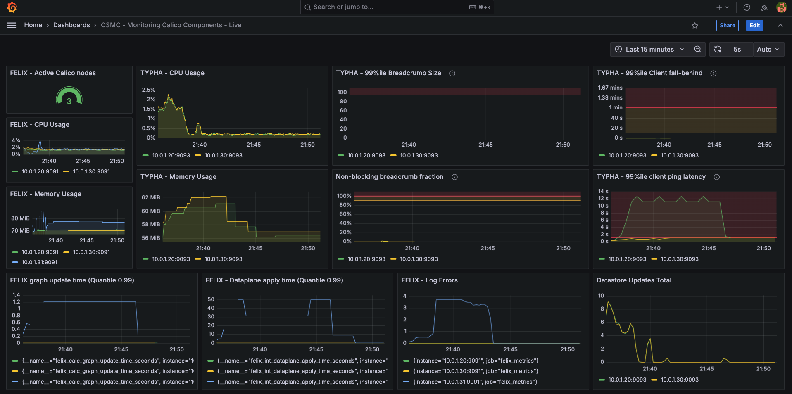

# Monitoring Calico Components - DEMO

### Content of this repo

* [Thank You!](#thank-you)
* [Overview](#overview)
* [Before you begin...](#before-you-begin)
* [Demo](#demo)

### Thank you!

Thank you for attending the OSMC in Nuremberg and the presentation on "Monitoring Calico Components" by Tigera.

We hope you enjoyed the presentation and please feel free to download the slides from [here](etc/OSMC_Nuremberg_2024_Davide_Sellitri_Monitoring_Calico_Components.pdf).

We also encourage you to leave a feedback [here](https://forms.gle/GX8byFYZmACcYKHM6), about the presentation or Project Calico. You feedback is valuable!

---

### Overview

In this demo we will deploy Calico Open Source using Helm and monitor Calico core components: Typha and Felix. We will deploy Prometheus, Grafana and Grafana dashboards to see values of the top metrics and understand the baselines. Afterwards, we will upgrade Calico specifying very low limits for Typha, and run a script which will stress Calico components. Finally we look at how values change in the Grafana dashboard.

---

### Before you begin...

**IMPORTANT**

- This demo is **disruptive** and it is not meant to run in a any production cluster.
- **DO NOT** use the Typha limits shown in this demo in any cluster apart from this demo.
- The Grafana dashboards provided in this demo are not maintained by Tigera but serve for the purpose of this demo. Please feel free to adapt these dashboards or use the metrics at your convenience.

**About Calico Felix, Typha, and kube-controllers components**

**Felix** is a daemon that runs on every machine that implements network policy. Felix is the brains of Calico. Typha is an optional set of pods that extends Felix to scale traffic between Calico nodes and the datastore. The kube-controllers pod runs a set of controllers which are responsible for a variety of control plane functions, such as resource garbage collection and synchronization with the Kubernetes API.

You can configure Felix, Typha, and/or kube-controllers to provide metrics to Prometheus.

For more information about Typha and Felix, please visit these docs: [Typha](https://docs.tigera.io/calico/latest/reference/typha/) - [Felix](https://docs.tigera.io/calico/latest/reference/felix/).

---

### Demo

**1.** Get a test cluster and deploy Calico Open Source using Helm, following this [guide](https://docs.tigera.io/calico/latest/getting-started/kubernetes/helm). It is important to use Helm because we will use it later to change Typha resource limits.

**2.** Follow [this tutorial](https://docs.tigera.io/calico/3.28/operations/monitor/monitor-component-metrics) to go through the necessary steps to implement basic monitoring of Calico with Prometheus.

* Configure Calico to enable the metrics reporting.
* Create the namespace and service account that Prometheus will need.
* Deploy and configure Prometheus.
* View the metrics in the Prometheus dashboard and create a simple graph.

**3.** Follow [this tutorial ](https://docs.tigera.io/calico/latest/operations/monitor/monitor-component-visual)to go through the necessary steps to create Calico metrics dashboards with Grafana.

**4.** Import the additional `Demo_Grafana_Dashboard.json` in this repro, by following [these](https://grafana.com/docs/grafana/latest/dashboards/build-dashboards/import-dashboards/) instructions.

**5.** Go to the `OSMC - Monitoring Calico Components` dashboard and set the timeframe to 15 minutes and the Auto refresh to 5 seconds, as shown here:



**6.** Wait 5 to 10 minutes and take note of baselines of the metrics in the dashboard.

**7.** Upgrade Calico Open Source with very low Typha resource limits, using this Helm `values_osmc.yaml` file:

```
installation:
    enabled: true
    kubeletVolumePluginPath: "None"
    typhaDeployment:
      spec:
        template:
          spec:
            containers:
            - name: calico-typha
              resources:
                limits:
                  cpu: 1m
                  memory: 40Mi
```

You can use this command to upgrade Calico Open Source:

```
helm upgrade calico projectcalico/tigera-operator --values values_osmc.yaml -n tigera-operator
```

**(Optional)** Adjust these limits if the installation fails because of them.

**8**. Wait 5 to 10 minutes and take note of baselines of the metrics in the dashboard.

**9.** Deploy a `test-deployment` which we'll use to stress Calico components:

```
apiVersion: apps/v1
kind: Deployment
metadata:
  name: test-deploy
spec:
  replicas: 2
  selector:
    matchLabels:
      app: test-deploy
  template:
    metadata:
      labels:
        app: test-deploy
    spec:
      containers:
      - name: test-container
        image: wbitt/network-multitool
      affinity:
        podAntiAffinity:
          requiredDuringSchedulingIgnoredDuringExecution:
          - labelSelector:
              matchExpressions:
              - key: "k8s-app"
                operator: In
                values:
                - calico-typha
            namespaceSelector:
              matchLabels:
                name: calico-system
            topologyKey: "kubernetes.io/hostname"

```

**NOTE**: Make sure that `calico-typha` and the `test-deploy` pods are not scheduled on the same nodes.

**10.** Wait 5 to 10 minutes to see the new baselines and take note of them.

**11.** Stress Calico Typha by scaling up and down the `test-deploy` deployment, with this script:

```
while true; do kubectl scale deployment test-deploy --replicas=10; sleep 2; kubectl scale deployment test-deploy --replicas=1;sleep 5; done
```

**12.** Watch the dashboard and notice how values change drastically. After a while you should also see that the number of Calico Active nodes is lower than the number of nodes in your cluster.

**13.** Stop the script and cleanup the cluster.

> **Congratulations! You have completed 'Monitoring Calico Components' demo! Please leave a feedback [here](https://forms.gle/GX8byFYZmACcYKHM6)**
